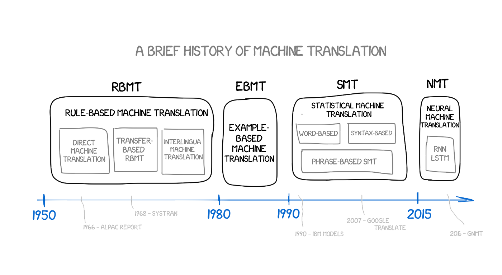
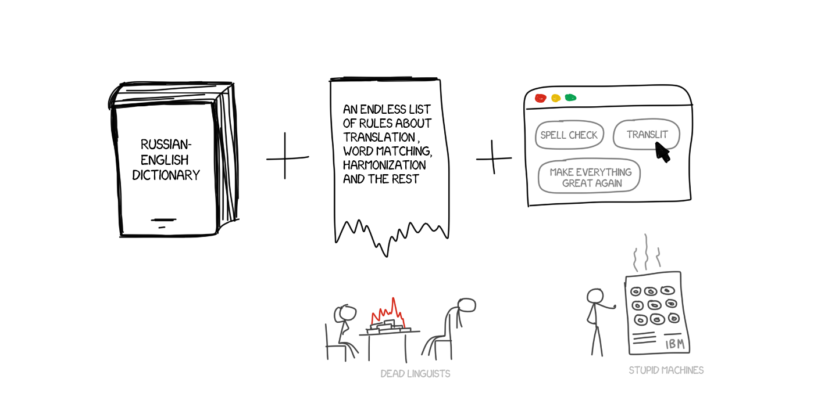
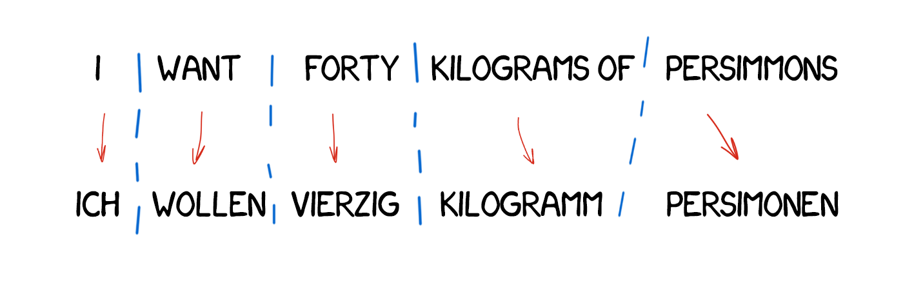
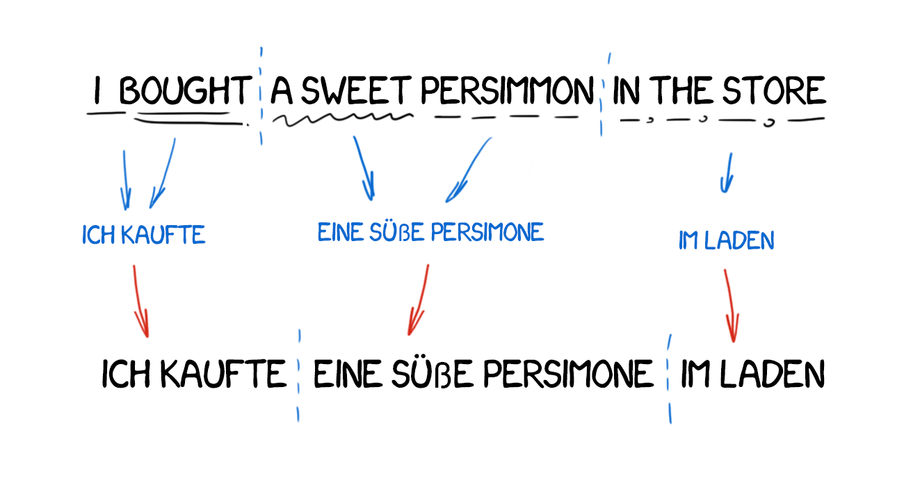
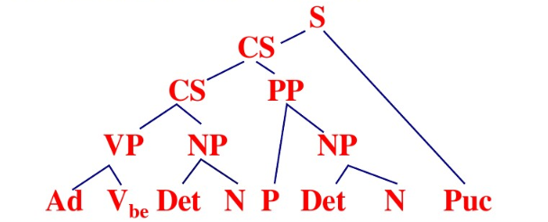
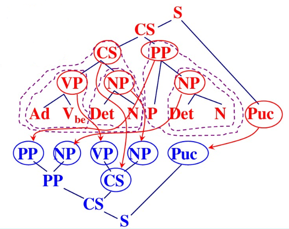
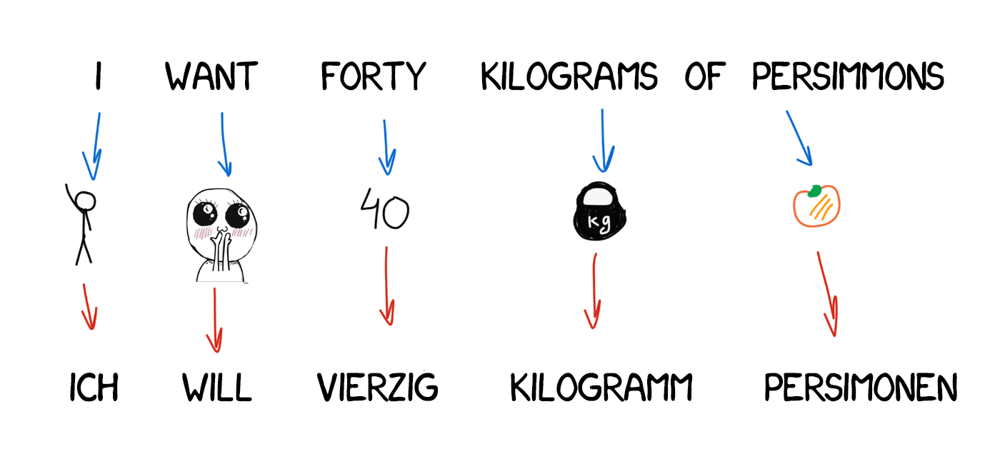
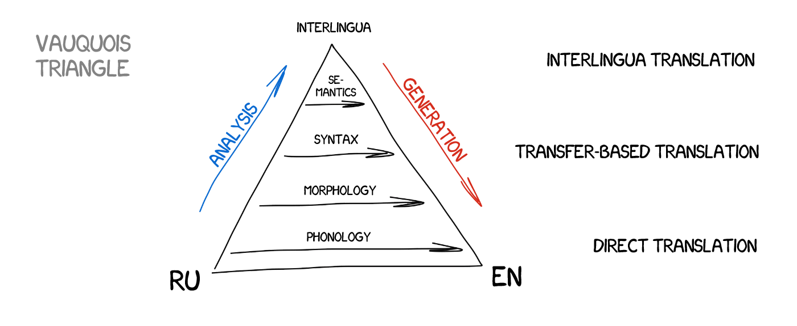

# 机器翻译
## 1. 背景
### 1.1 研究目的

- 语言障碍制约全球化发展；
- 社会需求巨大，但翻译代价昂贵；
- 机器翻译涉及计算机科学、语言学、数学以及认知科学等若干学科与技术，具有重要的科学意义。

### 1.2 定义

源语言(Source Language) -> 机器翻译(Machine Translation) -> 目标语言(Target Language)

### 1.3 历史

- 1954 年 1 月 7 日，美国乔治顿(Georgetown)大学与 IBM 公司合作，进行的第一个机器翻译实验
- 热潮，诞生了计算语言学这个新兴的学科
- 1966 年，美国科学院的 ALPAC 报告中称机器翻译是昂贵的、不准确的和毫无希望的
- 低潮
- 20 世纪 70 年代中期以后，产出一系列机器翻译研究的新成果和新计划
- 发展

## 2. 机器翻译方法

### 2.1 基于规则的机器翻译(Rule-Based Machine Translation, RBMT)

最早的基于规则的机器翻译思想出现在 20 世纪 70 年代初期。

RBMT 系统包含：

- 语言学规则
    + SL 词法分析器
    + SL 句法/语义解析器
    + 转换器
    + TL 词法生成器
    + TL 解析器
- 词典
    + SL 词典
    + 双语词典
    + TL 词典

其中，RBMT 系统中非常有名的案例：

- [Systran](http://www.systran.de/)
- [Japanese MT systems](http://aamt.info/english/mtsys.htm)
- [EUROTRA](https://en.wikipedia.org/wiki/Eurotra)

#### 2.1.1 基于词典的机器翻译(Dictionary-Based Machine Translation, DBMT)

也称为“直接翻译方法”。

- **方法**：从源语言句子的表层出发，将单词或者词组、短语甚至句子直接置换成目标语言译文，有时进行一些简单的词序调整。

    

- **优点**：规则相对较简单。
- **缺点**：对原文句子的分析仅满足于特定译文生成的需要；效果差，时间花销大。

#### 2.1.2 基于转换的机器翻译(Transfer-Based Machine Translation, TBMT)

- **代表系统**: 
    + 法国格勒诺布尔(Grenoble)原医科大学信息与应用数学研究院(IMAG)机器翻译研究组(GETA)开发的 ARIANE 翻译系统。

- **方法**：对输入文本进行分析，形成源语言抽象的内部表达；将源语言内部表达转换成抽象的目标语言内部表达；根据目标语言内部表达生成目标语言文本。

    

- **优点**：可以较好地保持原文结构，产生的译文结构与原文结构关系密切，尤其对于语言现象已知或句法结构规范的源语言句子具有较强的处理能力和较好地翻译效果。
- **缺点**：分析规则由人工编写，工作量大，规则的主观性强，规则的一致性难以保障，不利于系统扩充，尤其对非规范的语言现象缺乏相应的处理能力。

##### 实例

1. 源语言句子 ->

    

2. 词法分析 -> 

    

3. 利用句法规则进行句法结构分析 ->

    

4. 利用转换规则将源语言句子结构转换成目标语言句子结构 ->

    

5. 将源语言词翻译成目标语言词汇
6. 译文词法处理和目标语言句子生成 ->

    

#### 2.1.3 基于中间语言的机器翻译(Interlingua-Based Machine Translation, IBMT)

- **代表系统**：JANUS (CMU) 早期版本
- **方法**：首先将源语言分析成一种与具体语种无关的通用语言(universal language)或中间语言(interlingua)，然后根据中间语言生成相应的目标语言。

    

- **典型的中间语言**：
    + 国际先进语音翻译研究联盟(C-STAR)定义的中间转换格式(Interchange Format, IF)
    + 日本东京联合国大学(United Nations University)提出的通用网络语言(Universal Networking Language, UNL)

- **优点**：适用于多语言之间的互译，大大地减少了系统实现的工作量。
- **缺点**：如何定义和设计中间语言的表达方式很难，在语义表达的准确性、完整性、鲁棒性和领域可移植性等诸多方面多面临很多困难。

#### 2.1.4 总结

基于规则的机器具有可解释性、形态准确性，特定领域表现不错，但翻译需要大量的专业的人力，而且针对不同的语种特性以及个体存在的表示方式差异性，很难用统一的规则进行转换，跨领域效果不好且难以迁移。因此，RBMT 这一方法以及被摒弃，但是它的思想还是值得借鉴的，例如中间语言。同时它在形态层面、句法层面、甚至语义层面的表征都是现在继续使用的。

### 2.3 基于语料库的机器翻译(Corpus-Based Machine Translation, CBMT)

自 20 世纪 80 年代末期以来，语料库技术和统计机器学习方法在机器翻译研究中的广泛应用，打破了长期以来分析方法一统天下的僵局，机器翻译研究进入了一个新纪元。

#### 2.3.1 基于记忆的机器翻译(Memory-Based Machine Translation, MBMT)

- **方法**：假设人类进行翻译时是根据以往的翻译经验进行的，不需要对句子进行语言学上的深层分析，翻译时只需要将句子拆分成适当的片段，然后将每一个片段与已知的例子进行类比，找到最相似的句子或片段所对应的的目标语言句子或片段作为翻译结果，最后将这些目标语言片段组合成一个完整的句子。

#### 2.3.2 基于实例的机器翻译(Example-Based Machine Translation, EBMT)

由日本著名学者长尾真(Makoto Nagao)于 20 世纪 80 年代初期提出，但真正实现是在 80 年代末期。

- **方法**：需要对已知语料进行词法、句法，甚至语义等分析，建立实例库用以存放翻译实例。系统在执行翻译过程时，首先对翻译句子进行适当的预处理，然后将其与实例库中的翻译实例进行相似性分析，最后，根据找到的相似实例的译文得到翻译句子的译文。

#### 2.3.3 统计翻译方法(statistical machine translation, SMT)

#### 2.3.4 神经网络翻译方法(neural network machine translation, NNMT)

## 参考文献
- [Statistical Machine Translation Tutorial Reading](http://cseweb.ucsd.edu/~dkauchak/mt-tutorial/)
- [Machine Translation
From the Cold War to Deep Learning](http://vas3k.com/blog/machine_translation/)