# Attention Is All You Need (Transformer)
[TOC]

## 1. 背景
针对序列问题，主流的方法有**循环神经网络**（包括 RNN、LSTM、GRU 等）和**卷积神经网络**。

### 1.1 循环神经网络存在的问题
1. 存在**长期依赖问题**；
2. 计算是顺序的，从而限制了模型的**并行能力**。

### 1.2 卷积神经网络存在的问题
1. **计算复杂度**高，计算量与序列长度成正比（ConvS2S呈线性，ByteNet呈对数）。

## 2. Transformer 模型结构
### 2.1 Encoder & Decoder Stacks
Transformer 从 high-level 来看，同样具有典型的 **encoder-decoder** 结构。

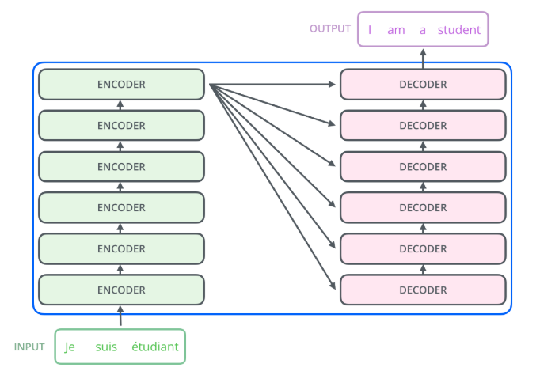

#### 2.1.1 Encoder
由六层结构完全相同的编码器首尾相连堆砌而成，每一层有两个子层：

- **multi-head self-attention mechanism**
- **position-wise fully connected feed-forward network**

同时，在每一个子层上使用了 **residual connection** 和 **layer normalization**。

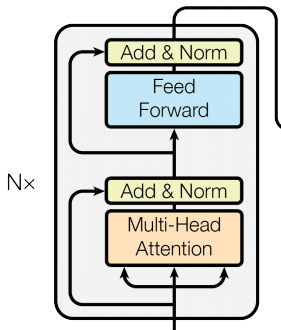

#### 2.1.2 Decoder
由六层结构完全相同的解码器堆砌而成，每一层有三个子层：

- **Masked multi-head self-attention mechanism**
- **Multi-head attention**
- **position-wise fully connected feed-forward network**

同时，也在每一个子层上使用了 **residual connection** 和 **layer normalization**。

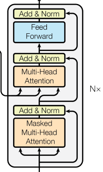

### 2.2 Attention
Attention 机制可以被描述为将 query 和 key-value pairs 映射到 output：先由 query 和 key 求得权重，再求 value 的权重之和得到 output。

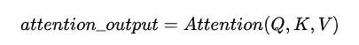

#### 2.2.1 Scaled Dot-Product Attention
两种最常用的 attention function 是：

- **additive attention**
- **dot-product attention**

两个函数的理论复杂度相似，在 d_k（key 的维数）小的时候，两者表现相似，在 d_k 大的时候，前者表现更优异，但是在代码实践上，后者的计算速度更快、空间效率更高。

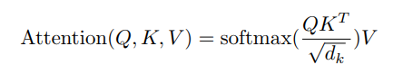

因此，本文采用 scaled dot-product attention，通过采用缩放因子 1/(d_k)^(1/2) 使梯度更加稳定。

##### 2.2.1.1 详细流程（以 encoder 内部 self-attention 为例）

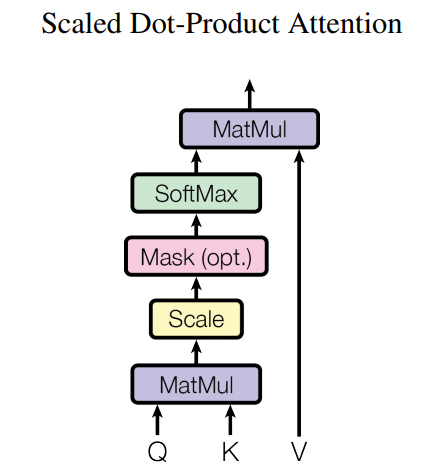

1.**Linear**  
将每个 input word 通过 embedding algorithm 得到 512 维的词向量。

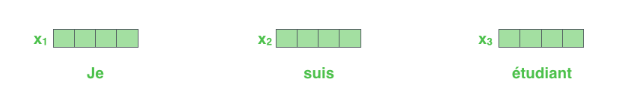 

将每一个词向量与训练中学习到的三个 512 * 64 的矩阵 W_Q, W_K 和 W_V （所有输入共享）相乘，得到三个 64 维的向量 Query, Key 和 Value。 

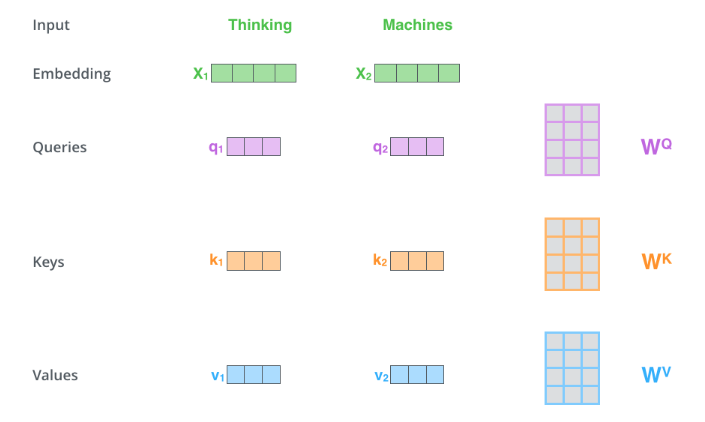  

>Tips: 思考 Query/Key/Value 各自的含义。

2.**MatMul**  
将向量 q 和 k 相乘得到 score，表示对某个确定位置的词进行编码的时候对句内其他部分的词的相关性。

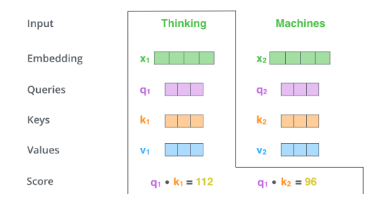

3.**Scale & SoftMax**  
采用缩放因子，使梯度更稳定，然后加上 softmax 操作，进行归一化，表示这个位置对每个词的关注程度。

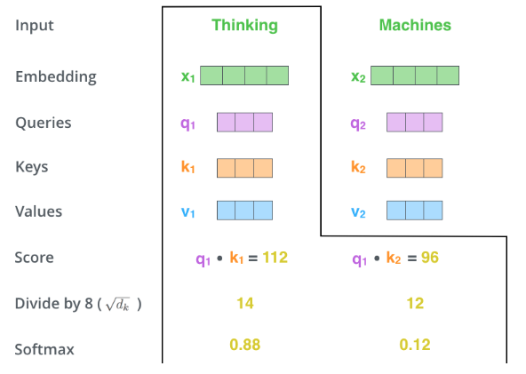

4.**MatMul & Sum**  
将 softmax score 和 value 按位相乘，保留关注程度高的词的 value，削弱关注程度低的词的 value，最后将所有加权向量加和，得到该位置的 self-attention 的输出结果。

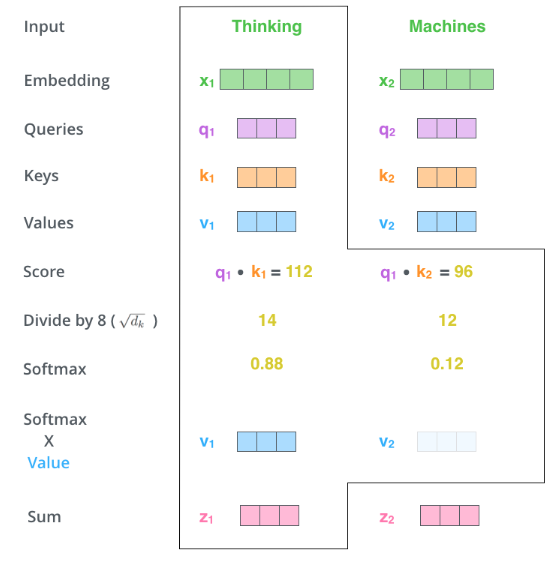

## 参考资料
- [Attention Is All You Need](https://arxiv.org/abs/1706.03762)
- [The Annotated Transformer](http://nlp.seas.harvard.edu/2018/04/03/attention.html) by Harvardnlp
