# Attention Is All You Need (Transformer)

* [Attention Is All You Need (Transformer)](#attention-is-all-you-need-transformer)
  * [1\. 背景](#1-%E8%83%8C%E6%99%AF)
    * [1\.1 循环神经网络存在的问题](#11-%E5%BE%AA%E7%8E%AF%E7%A5%9E%E7%BB%8F%E7%BD%91%E7%BB%9C%E5%AD%98%E5%9C%A8%E7%9A%84%E9%97%AE%E9%A2%98)
    * [1\.2 卷积神经网络存在的问题](#12-%E5%8D%B7%E7%A7%AF%E7%A5%9E%E7%BB%8F%E7%BD%91%E7%BB%9C%E5%AD%98%E5%9C%A8%E7%9A%84%E9%97%AE%E9%A2%98)
  * [2\. Transformer](#2-transformer)
    * [2\.1 Encoder &amp; Decoder Stacks](#21-encoder--decoder-stacks)
      * [2\.1\.1 Encoder](#211-encoder)
      * [2\.1\.2 Decoder](#212-decoder)
    * [2\.2 Attention](#22-attention)
      * [2\.2\.1 Scaled Dot\-Product Attention](#221-scaled-dot-product-attention)
        * [2\.2\.1\.1 Attention机制](#2211-attention%E6%9C%BA%E5%88%B6)
        * [2\.2\.1\.2 详细流程（以 encoder 内部 self\-attention 为例）](#2212-%E8%AF%A6%E7%BB%86%E6%B5%81%E7%A8%8B%E4%BB%A5-encoder-%E5%86%85%E9%83%A8-self-attention-%E4%B8%BA%E4%BE%8B)
        * [2\.2\.1\.3 实际应用——矩阵操作](#2213-%E5%AE%9E%E9%99%85%E5%BA%94%E7%94%A8%E7%9F%A9%E9%98%B5%E6%93%8D%E4%BD%9C)
      * [2\.2\.2 Multi\-Head Attention](#222-multi-head-attention)
        * [2\.2\.2\.1 详细流程](#2221-%E8%AF%A6%E7%BB%86%E6%B5%81%E7%A8%8B)
        * [2\.2\.2\.2 优点](#2222-%E4%BC%98%E7%82%B9)
      * [2\.2\.3 三种 Attention 方式](#223-%E4%B8%89%E7%A7%8D-attention-%E6%96%B9%E5%BC%8F)
        * [2\.2\.3\.1 Encoder\-Decoder Attention](#2231-encoder-decoder-attention)
        * [2\.2\.3\.2 Encoder Self\-Attention](#2232-encoder-self-attention)
        * [2\.2\.3\.3 Masked\-Decoder Self\-Attention](#2233-masked-decoder-self-attention)
    * [2\.3 Position\-wise Feed\-Forward Networks](#23-position-wise-feed-forward-networks)
  * [3\. 细节问题](#3-%E7%BB%86%E8%8A%82%E9%97%AE%E9%A2%98)
    * [3\.1 Residual Connection](#31-residual-connection)
    * [3\.2 Normalization](#32-normalization)
      * [3\.2\.1 Batch Normalization](#321-batch-normalization)
      * [3\.2\.2 Layer Normalization](#322-layer-normalization)
    * [3\.3 Mask](#33-mask)
      * [3\.3\.1 padding mask](#331-padding-mask)
      * [3\.3\.2 Sequence mask](#332-sequence-mask)
    * [3\.4 Embedding](#34-embedding)
      * [3\.4\.1 Positional Encoding](#341-positional-encoding)
  * [4\. 优点](#4-%E4%BC%98%E7%82%B9)
  * [5\. 参考资料](#5-%E5%8F%82%E8%80%83%E8%B5%84%E6%96%99)

## 1. 背景
针对序列问题，主流的方法有**循环神经网络**（包括 RNN、LSTM、GRU 等）和**卷积神经网络**。

### 1.1 循环神经网络存在的问题
1. 存在**长期依赖问题**；
2. 计算是顺序的，从而限制了模型的**并行能力**。

### 1.2 卷积神经网络存在的问题
1. **计算复杂度**高，计算量与序列长度成正比（ConvS2S呈线性，ByteNet呈对数）。

## 2. Transformer
Transformer 完全舍弃了 RNN 和 CNN，全部采用 attention 机制，架构如图。

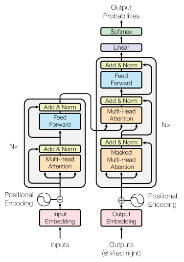

### 2.1 Encoder & Decoder Stacks
Transformer 从 high-level 来看，同样具有典型的 **encoder-decoder** 结构。

#### 2.1.1 Encoder
由六层结构完全相同的编码器首尾相连堆砌而成，每一层有两个子层：

- **multi-head self-attention mechanism**
- **position-wise fully connected feed-forward network**

同时，在每一个子层上使用了 **residual connection** 和 **layer normalization**。

#### 2.1.2 Decoder
由六层结构完全相同的解码器堆砌而成，每一层有三个子层：

- **Masked multi-head self-attention mechanism**
- **Multi-head attention**
- **position-wise fully connected feed-forward network**

同时，也在每一个子层上使用了 **residual connection** 和 **layer normalization**。

### 2.2 Attention
Attention 机制可以被描述为将 query 和 key-value pairs 映射到 output：先由 query 和 key 求得权重，再求 value 的权重之和得到 output。

#### 2.2.1 Scaled Dot-Product Attention
##### 2.2.1.1 Attention机制
Attention 机制分为很多种。

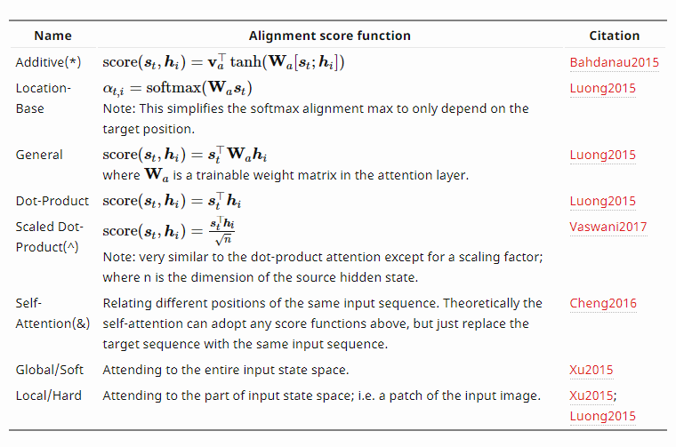

其中，两种最常用的 attention function 是：

- **additive attention**
- **dot-product attention**

两个函数的理论复杂度相似，在 d_k（key 的维数）小的时候，两者表现相似，在 d_k 大的时候，前者表现更优异，但是在代码实践上，后者的计算速度更快、空间效率更高。

因此，本文采用 scaled dot-product attention，通过采用缩放因子 1/(d_k)^(1/2) 使梯度更加稳定。

##### 2.2.1.2 详细流程（以 encoder 内部 self-attention 为例）

1.**Linear**  
将每个 input word 通过 embedding algorithm 得到 512 维的词向量。

 

将每一个词向量与训练中学习到的三个 512 * 64 的矩阵 W_Q, W_K 和 W_V （所有输入共享）相乘，得到三个 64 维的向量 Query, Key 和 Value。 

  

>Tips: 思考 Query/Key/Value 各自的含义。

2.**MatMul**  
将向量 q 和 k 相乘得到 score，表示对某个确定位置的词进行编码的时候对句内其他部分的词的相关性。

3.**Scale & SoftMax**   
采用缩放因子，使梯度更稳定，然后加上 softmax 操作，进行归一化，表示这个位置对每个词的关注程度。

4.**MatMul & Sum**  
将 softmax score 和 value 按位相乘，保留关注程度高的词的 value，削弱关注程度低的词的 value，最后将所有加权向量加和，得到该位置的 self-attention 的输出矩阵。

##### 2.2.1.3 实际应用——矩阵操作
1.**Linear**  
将所有词向量合并为输入矩阵 X，并且分别乘以权重矩阵 W_Q, W_K, W_V，得到 Query, Key, Value 矩阵。

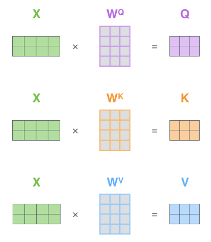

2.**Self-Attention**  
用矩阵处理，将剩余步骤合并成计算 self-attention 层输出的公式。

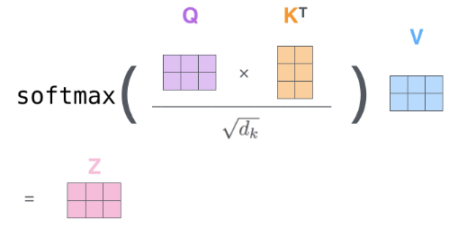

#### 2.2.2 Multi-Head Attention
Multi-Head Attention 将不同位置不同子空间的信息联合起来。

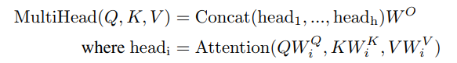

##### 2.2.2.1 详细流程

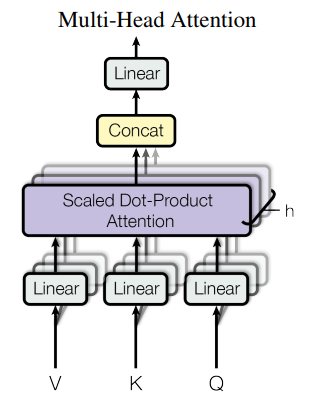

1.**Linear**  
共有 8 个 head，每一个 head 对应一组 W_Q, W_K, W_V 矩阵，从而得到 8 组 Query, Key, Value 矩阵。

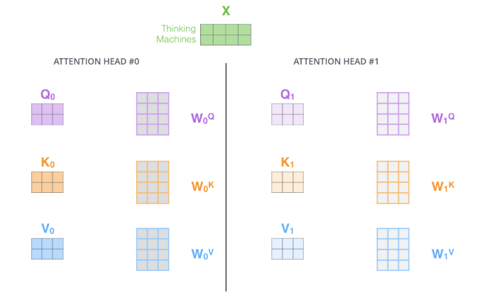

2.**Scaled Dot-Product Attention**  
按上述步骤计算，得到 8 个不同的输出矩阵。

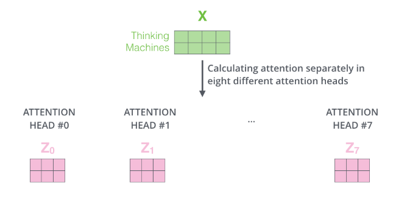

3.**Concat & Linear**  
将 8 个输出矩阵拼接，并进行线性变换，乘以另外的权重矩阵 W_O。

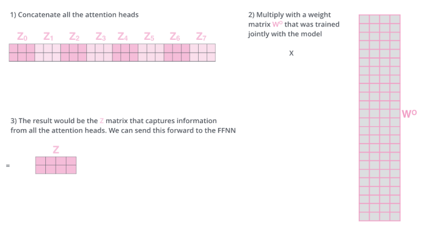

##### 2.2.2.2 优点
1. 扩展了模型集中于不同位置的能力。
2. 提供了多种 representation subspaces。

#### 2.2.3 三种 Attention 方式

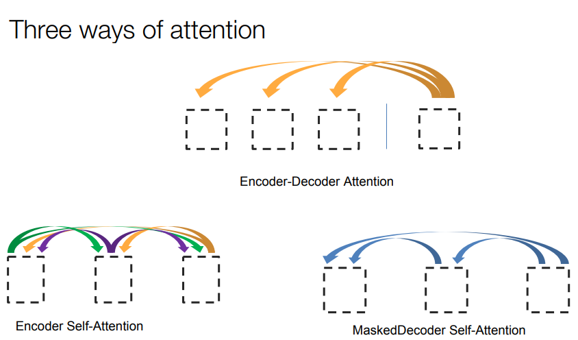

##### 2.2.3.1 Encoder-Decoder Attention
- Query: 来自前一层 decoder layer
- Key & Value: 来自 encoder 的输出

##### 2.2.3.2 Encoder Self-Attention
- Query, Key & Value: 来自前一层 encoder layer

##### 2.2.3.3 Masked-Decoder Self-Attention
- Query, Key & Value: 来自前一层 decoder layer
- 采用 Mask 防止利用之后的信息

### 2.3 Position-wise Feed-Forward Networks
两层全连接网络，第一层是 ReLU，第二层是线性激活，可以看成两层的 1 * 1 的 1d-conv。
其中，hidden-size 的变化为：512 -> 2048 -> 512。

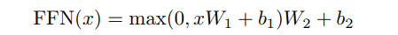

## 3. 细节问题
### 3.1 Residual Connection

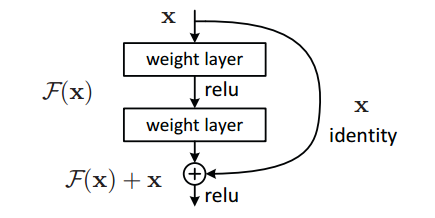

假设网络中某个层对输入 x 作用之后的输出为 F(x)，增加了残差连接之后，变为 F(x) + x。因为增加了项 x，所以该层网络对 x 求偏导时，多了常数项 1，导致反向传播过程中，不会产生梯度消失。

### 3.2 Normalization
Normalization 有很多种，但目的都是把输入转化为均值为 0 方差为 1 的数据。对输入数据做归一化，但经过网络层的作用后，数据已经不再是归一化的，随之数据的偏差越来越大。

#### 3.2.1 Batch Normalization
- 主要思想：在每一层的每一批数据上进行归一化。

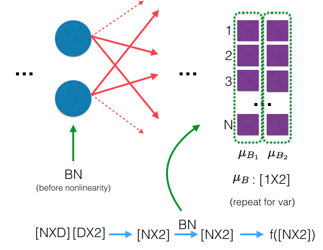

#### 3.2.2 Layer Normalization
- 主要思想：在每一个样本上进行归一化。

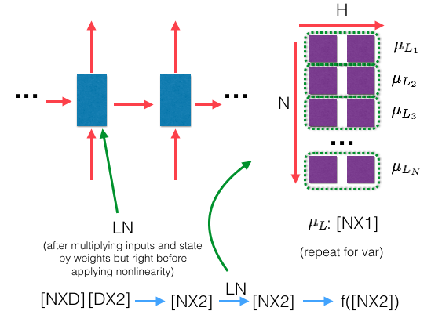

### 3.3 Mask
#### 3.3.1 padding mask
因为每个批次的输入序列长度不同，在对输入序列进行对齐的时候，需要在较短的序列后面填充 0 。但是这些填充的位置是没有意义的，所以在 attention 机制实现的时候，应该尽可能使权重降低。具体的做法是，把这些位置的值加上一个非常大的负数(可以是负无穷)，经过 softmax 后，这些位置的概率就会接近 0。

#### 3.3.2 Sequence mask
使 decoder 看不到未来的信息，也就是说，在 time_step 为 t 的时刻，解码输出应该只能依赖于 t 时刻之前的输出，而不能依赖 t 时刻之后的输出。因此，需要产生一个上三角矩阵，上三角的值全为 1 ，下三角的值全为 0 ，对角线也是 0 。把这个矩阵作用在每一个序列上，就可以把未来的信息隐藏起来。
效果如图。

### 3.4 Embedding

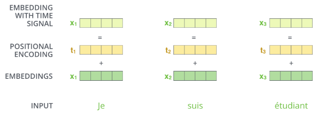

#### 3.4.1 Positional Encoding
因为 Transformer 完全摒弃了 RNN 和 CNN，无法利用所需要的位置信息，所以必须要另外添加位置信息，包括绝对位置信息和相对位置信息。

本文中提到了两种方法：

- 用不同频率的 sin 和 cos 函数直接计算
- learned positional embedding

采用了第一种方法，因为利用正弦和余弦函数的周期性，可对相对位置关系进行建模，同时比较从训练中学习到的 positional embedding，不会受到训练序列的长度的影响。

## 4. 优点

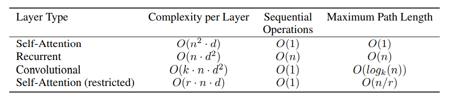

1. 每层计算复杂度低；
2. 并行计算，序列操作复杂度为常数项；
3. 计算一个序列长度为n的信息要经过的路径长度很短：cnn 需要增加卷积层数来扩大视野，rnn 需要从 1 到 n 逐个进行计算，而 self-attention 只需要一步矩阵计算就可以。

## 5. 参考资料
- [Attention Is All You Need](https://arxiv.org/abs/1706.03762)
- [The Illustrated Transformer](http://jalammar.github.io/illustrated-transformer/)
- [The Annotated Transformer](http://nlp.seas.harvard.edu/2018/04/03/attention.html) by Harvardnlp
