# 循环神经网络
[TOC]

## 1. 背景
> 前馈神经网络难以处理时序数据：

> - 前馈神经网络的输出只依赖于当前的输入；  
> - 前馈神经网络要求输入和输出的维数都是固定的，但时序数据的长度一般是不固定的。

## 2. 使网络具备短期记忆能力的三种方法
>### 2.1 延时神经网络（Time Delay Neural Network）
>>在前馈网络中的非输出层都添加一个延时器，记录最近几次神经元的输出。在第 t 个时刻，第  l+1 层神经元和第 l 层神经元的最近 p 次输出相关，即，

>>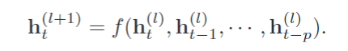  

>### 2.2 有外部输入的非线性自回归模型（Autoregressive Model）
>>是自回归模型的扩展，在每个时刻 t 都有一个外部输入 x_t，产生一个输出 y_t。通过一个延时器记录最近几次的外部输入和输出，第 t 个时刻的输出 y_t为，

>>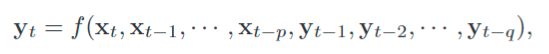  

>>其中 f(·) 代表非线性函数，p 和 q 为超参数。

>### 2.3 循环神经网络（Reccurent Neural Networks）
>>通过使用带自反馈的神经元，能够处理任意长度的时序数据。 

>>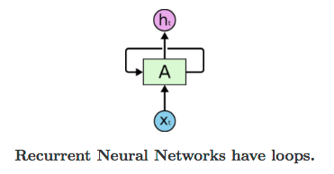  

    Tips：不要与递归神经网络（Recursive Neural Networks）混淆。

## 3. 简单循环神经网络
>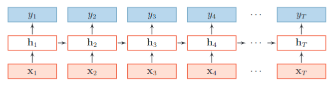

>### 3.1 结构
>>假设在时刻 t 时，网络的输入为 x_t，隐藏层状态为 h_t 不仅和当前时刻的输入 x_t相关，也和上一个时刻的隐藏层状态 h_{t-1} 相关。  

>>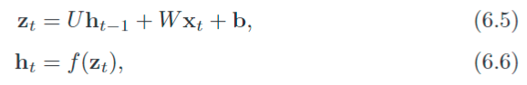 

>>其中 z_t 为隐藏层的净输入，f(·) 是非线性激活函数，U 为状态-状态权重矩阵，W 为状态-输入权重矩阵，b 为偏置，可以看作在时间维度上权值共享。

>>或直接表示为，

>>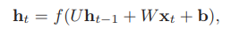 

    TIPS：h_0 一般被初始化为0，但用非零初始化值被证实可以改善稳定性和表现。

>>输出为 y_t，

>>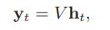 

>### 3.2 参数共享的优点
>>- 模型训练复杂度降低；
>>- 位置无关，导致泛化能力更强。

>### 3.3 强大的计算能力
>>#### 3.3.1 通用近似定理
    如果一个完全连接的循环神经网络有足够数量的 sigmoid 型隐藏神经元，它可以以任意的准确率去近似任何一个非线性动力系统:  
        s_t = g(s_{t-1}, x_t)
        y_t = o(s_t)
    其中 s_t 为每个时刻的隐状态，x_t 是外部输入，g(·) 是可测的状态转换函数，o(·) 是连续输出函数，并且对状态空间的紧致性没有限制。

>> 

>>#### 3.3.2 图灵完备（Turing Completeness）
    所有的图灵机都可以被一个由使用 sigmoid 型激活函数的神经元构成的全连接循环网络来进行模拟。

>### 3.4 短时记忆原理
>>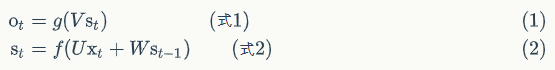 

>>反复把式2代入到式1：

>>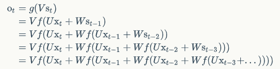 

>>可以看出，循环神经网络的输出值 o_t，是受前面输入值 x_t, x_{t-1}, x_{t-2}, ... 影响的，这就是为什么循环神经网络可以往前看多个输入值的原因。

>### 3.5 计算梯度的两种方式
>>#### 3.5.1 随时间反向传播算法（Backpropagation Through Time）
    BPTT 算法是针对循环层的训练算法，它的基本原理和 BP 算法是一样的，包含三个步骤：
        1. 前向计算每个神经元的输出值；
        2. 反向计算每个神经元的误差项 δ_j 值，它是误差函数 E 对神经元 j 的加权输入 net_j 的偏导数；
        3. 计算每个权重的梯度。
    最后再用随机梯度下降算法更新权重。

>>> 

>>> 

>>>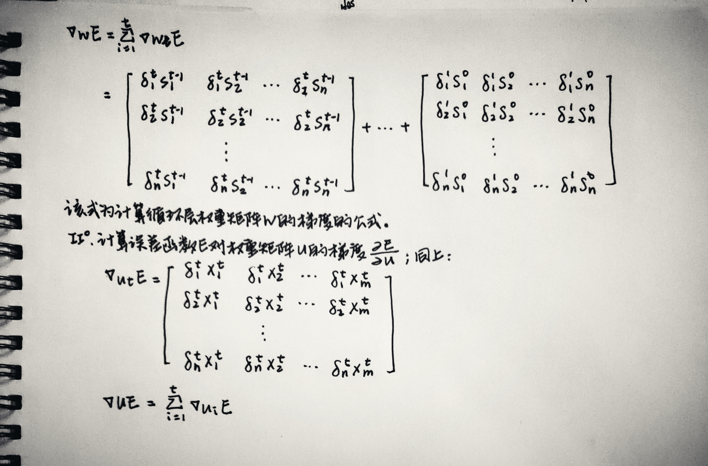 

>>>计算复杂度：参数的梯度需要在一个完整的“前向”计算和“反向”计算后才能得到并进行参数更新。

>>#### 3.5.2 实时循环学习算法（Real-Time Recurrent Learning）
>>>通过前向传播的方式来计算梯度。
>>>假设循环网络网络中第 t + 1 时刻的状态 h_{t+1}为，

>>>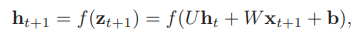 

>>>其关于参数 u_{ij} 的偏导数为，

>>>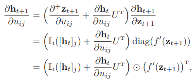 

>>>其中，I_i(x) 除了第 i 行值为 x 外，其余都为 0 的行向量。
>>>从第 1 个时刻开始，除了计算循环神经网络的隐状态之外，还可以一次前向计算偏导。
>>>假设第 t 个时刻存在一个监督信息，其损失函数为 L_t，就可以同时计算损失函数对 u_{ij}的偏导数，

>>>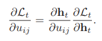 

>>>这样，在第 t 时刻，可以实时地计算损失 L_t 关于参数 U 的梯度，并更新参数，同时参数 W 和 b 的梯度也可以同样按上述方法实时计算。

>#### 3.5.3 两种算法比较
>>- RTRL算法和BPTT算法都是基于梯度下降的算法；
>>- RTRL算法通过前向模式应用链式法则来计算梯度，而BPTT算法采用后向模式；
>>- 在循环神经网络中，一般网络输出维度远低于输入维度，因此 BPTT 算法的计算量会更小，但是 BPTT 算法需要保存所有时刻的中间梯度，空间复杂度较高，而 RTRL s算法不需要梯度回传，因此非常适合用于需要在线学习或无限序列的任务中。

>### 3.6 长期依赖问题（梯度爆炸和消失问题）
>>#### 3.6.1 原因
>>>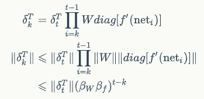 

>>>其中，β 定义为矩阵的模的上界。令 γ = β_Wβ_f，则若 γ > 1，t - k -> ∞ 时，会造成系统不稳定，称为梯度爆炸问题（Gradient Exploding Problem）；若 γ < 1，t - k -> ∞ 时，γ ^ (t - k) -> 0，会出现梯度消失问题（Gradient Vanishing Problem）。

>>>由于循环神经网络经常使用非线性激活函数为 Logistic 函数或 Tanh 函数作
为非线性激活函数，其导数值都小于 1；并且权重矩阵 ∥W∥ 也不会太大，因此如
果时间间隔 t − k 过大，δ_{t,k} 会趋向于0，因此经常会出现梯度消失问题。

>>#### 3.6.2 改进方案
>>>##### 3.6.2.1 梯度爆炸
>>>>- 权重衰减：通过给参数增加 l_1 或 l_2 范数的正则化项来限制参数的取值范围，从而使 γ <= 1；
>>>>- 梯度截断：当梯度的模大于一定阈值时，就将它截断成为一个较小的数。

>>>##### 3.6.2.2 梯度消失
>>>>- 合理的初始化权重值：使得每个神经元尽可能不要取极大或极小值，以躲开梯度消失的区域；
>>>>- 使用 Relu 代替 sigmoid 和 tanh 作为激活函数；
>>>>- 使用其他结构的 RNNs，比如长短时记忆网络（LSTM）和Gated Recurrent Unit（GRU）。

## 4. 应用
>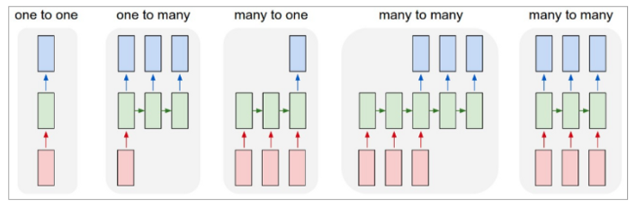 

>###4.1 1 to N

>>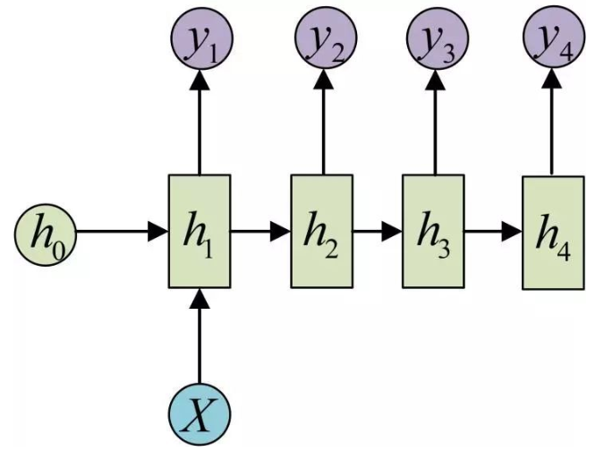 

>>或

>>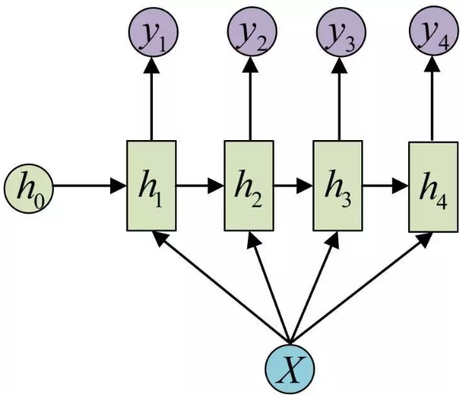 

>>####4.1.1 生成图像描述
>>>和卷积神经网络一起，给无标签的图像生成描述。

>>>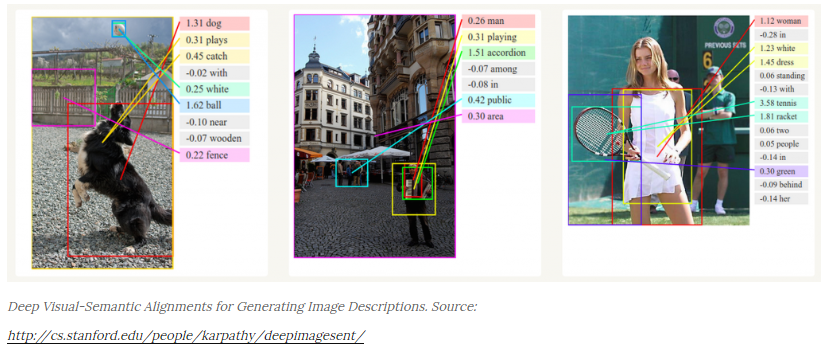

>>>相关论文：

>>>- [Deep Visual-Semantic Alignments for Generating Image Descriptions](https://cs.stanford.edu/people/karpathy/cvpr2015.pdf) 

>###4.2 N to 1

>>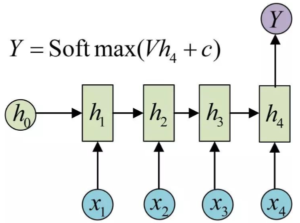 

>>####4.2.1 语言模型和文本生成
>>>给定一序列的词，预测每一个句子或词出现的概率。

>>>相关论文： 

>>>- [Recurrent neural network based language model](http://www.fit.vutbr.cz/research/groups/speech/publi/2010/mikolov_interspeech2010_IS100722.pdf)

>>>- [Extensions of Recurrent neural network based language model](http://www.fit.vutbr.cz/research/groups/speech/publi/2011/mikolov_icassp2011_5528.pdf)

>>>- [Generating Text with Recurrent Neural Network](http://machinelearning.wustl.edu/mlpapers/paper_files/ICML2011Sutskever_524.pdf)

>###4.3 N to N

>>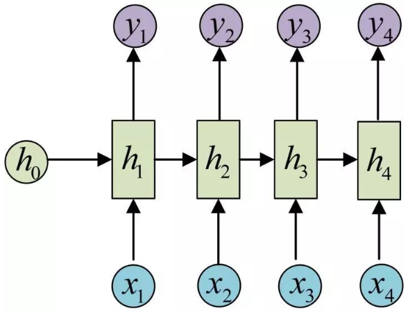

>>####4.3.1 语音识别
>>>将输入的一系列声音信号转化为文字。

>>>相关论文：

>>>- [A Recursive Recurrent Neural Network for Statistical Machine Translation](http://www.aclweb.org/anthology/P14-1140.pdf) 

>>>- [Speech Recognition with Deep Recurrent Neural Network](http://www.cs.cmu.edu/afs/cs/user/bhiksha/WWW/courses/deeplearning/Fall.2016/pdfs/1104/RNN13.pdf) 

>###4.4 N to M

>>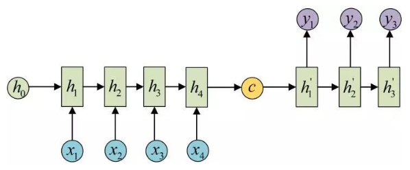

>>或

>>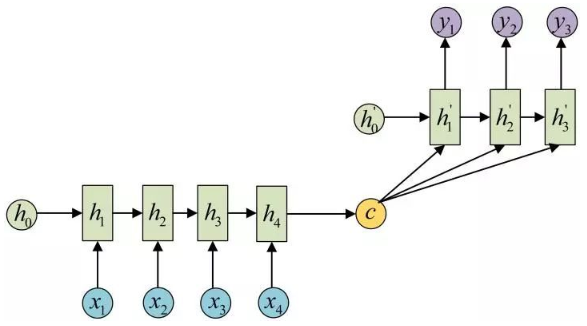

>>####4.4.1 机器翻译
>>>将输入的源语言转化为输出的目标语言。

>>>

>>>相关论文： 

>>>- [A Recursive Recurrent Neural Network for Statistical Machine Translation](http://www.aclweb.org/anthology/P14-1140.pdf) 

>>>- [Sequence to Sequence Learning with Neural Network](http://papers.nips.cc/paper/5346-sequence-to-sequence-learning-with-neural-networks.pdf) 

>>>- [Towards End-to-End Speech Recognition with Recurrent Neural Network](http://www.jmlr.org/proceedings/papers/v32/graves14.pdf) 

## 5. RNN的变种
>### 5.1 Elman Network
>### 5.2 Jordan Network
>### 5.3 双向循环神经网络（Bidirectional RNNs）
>### 5.4 长短时记忆神经网络（Long Short Term Memory）
>### 5.5 Gated Reccurent Unit Networks
>### 5.6 Connectionist Temporal Classification
>### 5.7 Multidimensional RNNs
>### 5.8 Hierarchical Subsampling RNNs
>### 5.9 深度循环神经网络（Deep RNNs）

## 参考文献
- [Calculus on Computational Graphs: Backpropagation](http://colah.github.io/posts/2015-08-Backprop/)
- [Recurrent Neural Networks Tutorial, Part 1 – Introduction to RNNs](http://www.wildml.com/2015/09/recurrent-neural-networks-tutorial-part-1-introduction-to-rnns/)
- [An Introduction to Recurrent Neural Networks](https://medium.com/explore-artificial-intelligence/an-introduction-to-recurrent-neural-networks-72c97bf0912)
- [零基础入门深度学习(5) - 循环神经网络](https://zybuluo.com/hanbingtao/note/541458)
- [《神经网络与深度学习》-邱锡鹏](https://zybuluo.com/hanbingtao/note/541458)

