# __Transition-Based Dependency Parsing with Stack Long Short-Term Memory__

__Chris Dyer, Miguel Ballesteros, Wang Ling, Austin Matthews, Noah A. Smith__  
*Marianas Labs, NLP Group of Pompeu Fabra University, Carnegie Mellon University*  
*ACL'15*

* [<strong>Transition\-Based Dependency Parsing with Stack Long Short\-Term Memory</strong>](#transition-based-dependency-parsing-with-stack-long-short-term-memory)
  * [<strong>1\. Background</strong>](#1-background)
    * [<strong>1\.1 Definition</strong>](#11-definition)
    * [<strong>1\.2 Advantages</strong>](#12-advantages)
    * [<strong>1\.3 Challenges</strong>](#13-challenges)
    * [<strong>1\.4 Solutions</strong>](#14-solutions)
  * [<strong>2\. Method</strong>](#2-method)
    * [<strong>2\.1 Stack LSTMs</strong>](#21-stack-lstms)
    * [<strong>2\.2 Dependency Parser</strong>](#22-dependency-parser)
      * [<strong>2\.2\.1 Transition Operations</strong>](#221-transition-operations)
      * [<strong>2\.2\.2 Token Embeddings and OOVs</strong>](#222-token-embeddings-and-oovs)
      * [<strong>2\.2\.3 Composition Functions</strong>](#223-composition-functions)
      * [<strong>2\.2\.4 Parser Operation</strong>](#224-parser-operation)
        * [<strong>2\.2\.4\.1 Algorithm</strong>](#2241-algorithm)
        * [<strong>2\.2\.4\.2 Model</strong>](#2242-model)
        * [<strong>2\.2\.4\.3 Formulations</strong>](#2243-formulations)
  * [<strong>3\. Experiments</strong>](#3-experiments)
    * [<strong>3\.1 Datasets</strong>](#31-datasets)
      * [<strong>3\.1\.1 English</strong>](#311-english)
      * [<strong>3\.1\.2 Chinese</strong>](#312-chinese)
    * [<strong>3\.2 Results</strong>](#32-results)
      * [<strong>3\.2\.1 English</strong>](#321-english)
      * [<strong>3\.2\.2 Chinese</strong>](#322-chinese)

## __1. Background__
### __1.1 Definition__
- Transition-based dependency parsing formalizes the parsing problem as a series of decisions that read words sequentially from a buffer and combine them incrementally into syntactic structures.

### __1.2 Advantages__
- The number of operations is linear in the length of the sentence.
- computationally efficient.

### __1.3 Challenges__
- Modeling which action should be taken in each of the unboundedly many states encountered as the parser progresses.

### __1.4 Solutions__
- Alternative transition sets simplify the modeling problem by making better attachment decisions, through feature engineering and more recently using neural networks.

## __2. Method__
### __2.1 Stack LSTMs__
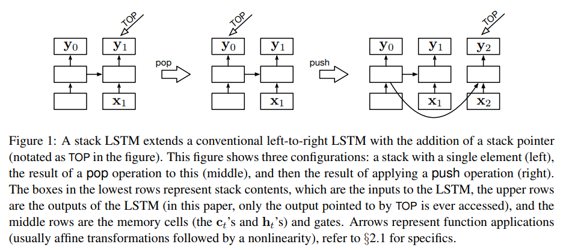  

- The LSTM with a "stack pointer".
- The **POP** operation moves the stack pointer to the previous element.
- The **PUSH** adds a new entry at the end of the list.

### __2.2 Dependency Parser__
#### __2.2.1 Transition Operations__
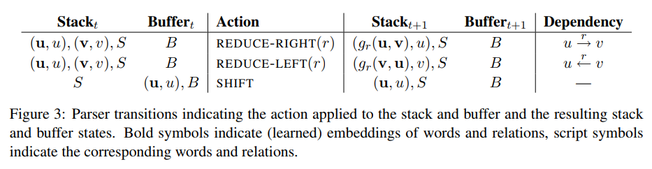 

#### __2.2.2 Token Embeddings and OOVs__
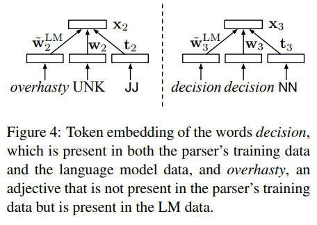   

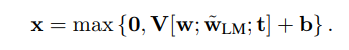 

- A learned vector representation for each word type (**w**);
- A fixed vector representation from a neural language model (**w_{LM}**)
- A learned representation (**t**) of the POS tag of the token, provided as auxiliary input to the parser.
- A linear map (**V**) is applied to the resulting vector and passed through a component-wise ReLU.
- **OOVs**: stochastically replace (with p = 0.5) each singleton word type in the parsing training data with the UNK token in each training iteration.
- **Pretrained word embeddings**: structured skip n-gram.

#### __2.2.3 Composition Functions__
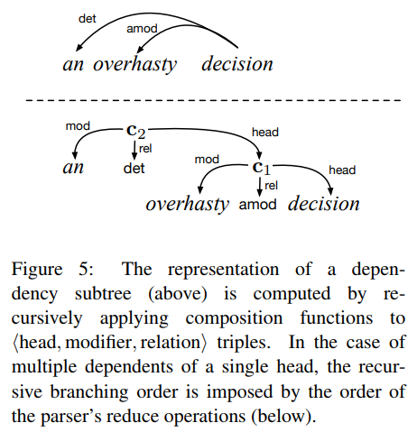  

 

- The syntactic head (**h**)
- The dependent (**d**)
- The syntactic relation being satisfied (**r**)
- Concatenating the vector embeddings of the head, dependent and relation, applying a linear operator and a component-wise non-linearity.
- For the relation vector, use an embedding of the parser action that was applied to construct the relation.

#### __2.2.4 Parser Operation__
##### __2.2.4.1 Algorithm__
- Initialized by pushing the words and their representations of the input sentence in reverse order onto B such that the first word is at the top of B and the ROOT symbol is at the bottom, and S and A each contain an empty-stack token.
- At each time step, the parser computes a composite representation of the stack states and uses that to predict an action to take, which updates the stack.
- Completes when B is empty, S contains two elements, one representing the full parse tree headed by the ROOT symbol and the other the empty-stack symbol, and A is the history of operations taken by the parser.

##### __2.2.4.2 Model__
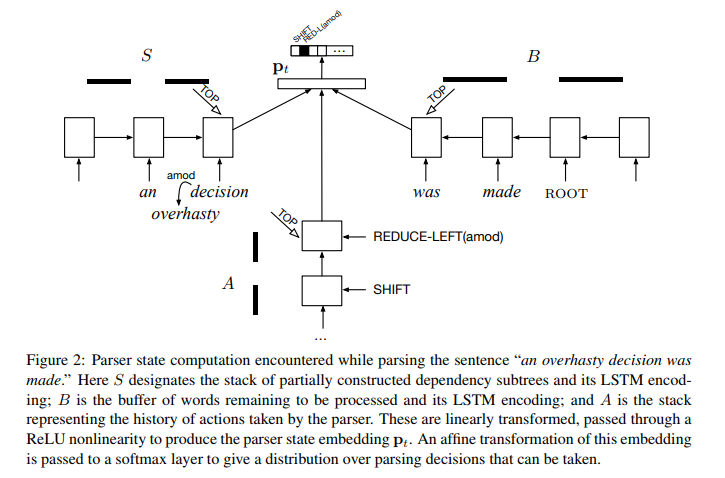 

##### __2.2.4.3 Formulations__
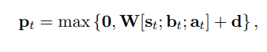 

- **P_t** is the parser state representation at time t, which is used to determine the transition to take.
- **W** is a learned parameter matrix.
- **b_t** is the stack LSTM encoding of the input buffer B.
- **s_t** is the stack LSTM encoding of S.
- **a_t** is the stack LSTM encoding of A.
- **d** is a bias term.
- Passed through a component-wise ReLU nonlinearity.

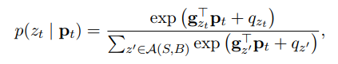 

- The parser state **p_t** is used to compute the probability of the parser action at time t.

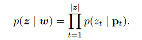 

- The chain rule may be invoked to write the probability of any valid sequence of parse actions **z** conditional on the input.

## __3. Experiments__
### __3.1 Datasets__
#### __3.1.1 English__
- The Stanford Dependency treebank contains a negligible amount of non-projective arcs (Chen and Manning, 2014).
- The part-of-speech tag are predicted by using the Stanford Tagger with an accuracy of 97.3%.
- Language model word embedding were generated from the AFP portion of the English Gigaword corpus (version 5).

#### __3.1.2 Chinese__
- The Penn Chinese Tree-bank 5.1 (Zhang and Clark, 2008).
- Gold part-of-speech tags (Chen and Manning, 2014).
- Language model word embedding were generated from the complete Chinese Gigaword corpus (version 2) as segmented by the Stanford Chinese Segmenter (Tseng et al., 2005).

### __3.2 Results__
- Exclude punctuation symbols for evaluation.

#### __3.2.1 English__
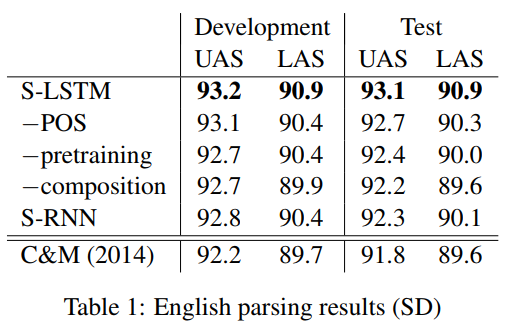 

#### __3.2.2 Chinese__
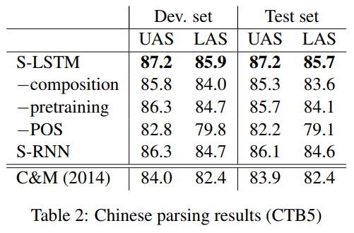 

