# Neural Machine Translation By Jointly Learning To Align And Translate

__Dzmitry Bahdanau, KyungHyun Cho, Yoshua Bengio__  
*Jacobs University Bremen, Universite de Montreal*  
*ICLR'15*

## 1. Motivation
### 1.1 Challenge
**Neral Machine Translation**

- A family of encoder-decoders and encode a source sentence into a fixed-length vector from which a decoder generates a translation.

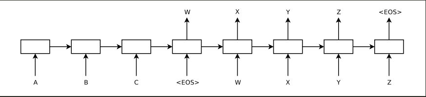

**Issue**

- Compressing all the necessary information of a source sentence into a fixed-length vector will lose the effective information.
- The performance of long sentences deteriorates rapidly.

### 1.2 Solution
- Each time the proposed model generates a word in a translation, it (soft-)searches for a set of positions in a source sentence where the most relevant information is concentrated. The model then predicts a target word based on the context vectors associated with these source positions and all the previous generated target words. (Attention Mechanism)

## 2. Model

The new architecture consists of a bidirectional RNN as an encoder and a decoder that emulates searching through a source sentence during decoding a translation.

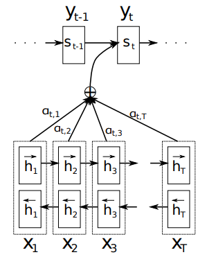

### 2.1 Encoder: Bidirectional RNN
A BiRNN consists of forward and backward RNNs. The annotation for each word x_j by concatenating the forward hidden state h_j(f) and the backward one h_j(b), i.e., h_j = [h_j(f);h_j(b)].

Each annotation h_i contains information about the whole input sequence with a strong focus on the parts surrounding the i-th word of the input sequence.

### 2.2 Decoder
Defination of each conditional probability.

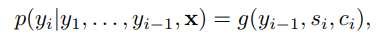

where s_i is an RNN hidden state for time i, computed by

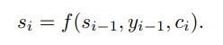

The context vector c_i is computed as a weighted sum of these annotations h_i. c_i is the expected annotation over all the annotations with probabilities a_{ij}.

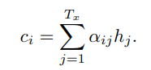

a_{ij} is a probability that the target word y_i is aligned to a source word x_j. The weight a_{ij} of each annotation h_j is computed by

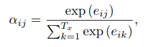

where

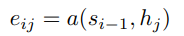

is an alignment model which scores how well the inputs around position j and the output at position i match. The alignment model directly computes a soft alignment, which allows the gradient of the cost function to be backpropagated through.

#### 2.3 Advantage
- The decoder decides parts of the source sentence to pay attention to.
- Instead of compressing all information in the source sentence into a fixed-length vector, the information can be spread throughout the sequence of annotations which can be selectively retrieved by the decoder accordingly.

## 3. Experiment
### 3.1 Dataset
- WMT'14 contains the following English-French parallel corpora: Europarl (61M words), news commentary (5.5M), UN(421M) and two crawled corpora of 90M and 272.5M words respectively, totaling 850M words.
- Reduce the size of the combined corpus to have 348M words using the data selection method.
- Use a shortlist of 30,000 most frequent words in each language to train models, and any word not included in the shortlist is mapped to a special token ([UNK]).

### 3.2 Model
**Two types**

- An RNN Encoder-Decoder
    + 1000 hidden units
- The proposed model RNNsearch
    + forward and backward RNN each has 1000 hidden units
    + Decoder has 1000 hidden units

**Two ways**

- With the sentences of length up to 30 words (RNNencdec-30, RNNsearch-30)
- With the sentences of length up to 50 words (RNNencdec-50, RNNsearch-50)

### 3.3 Result
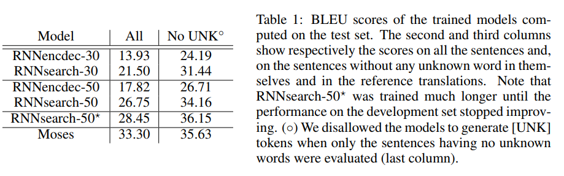

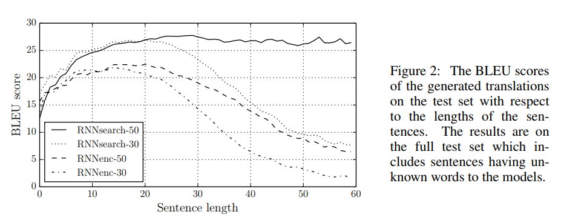

### 3.4 Analysis
#### 3.4.1 Alignment

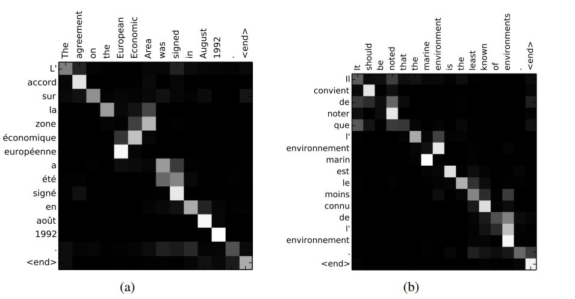
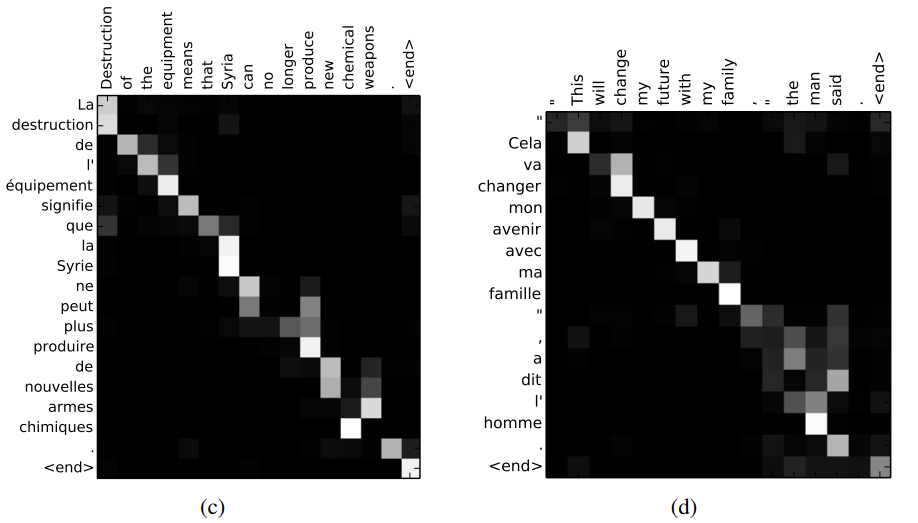
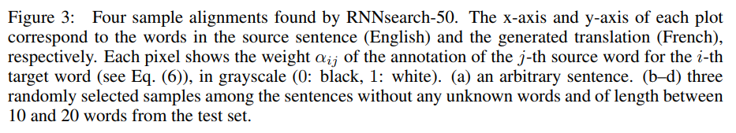

- Soft-alignment can let the model look at not only one word.
- Soft-alignment can deal with source and target phrases of different lengths, without requiring a counter-intuitive way of mapping some words to or from nowhere ([NULL]).

#### 3.4.2 Long sentences
The source sentence from the test set

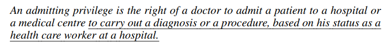

The RNNencdec-50

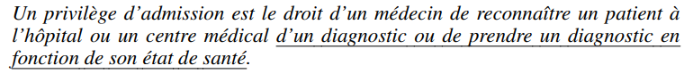

It replaced [based on his status as a health care worker at a hospital] in the source sentence with [enfonction de son etat de sante] ('based on his state of health').

The RNNsearch-50

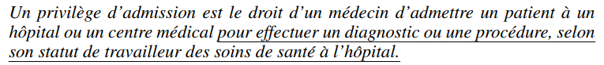

Preserving the whole meaning of the input sentence without omitting any details.

## 4. Future
- To better handle unknown, or rare words.
- Computation is expensive.