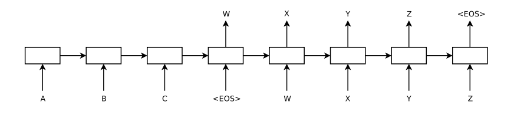
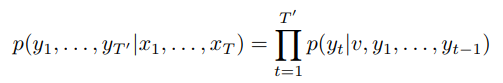
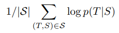
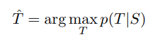
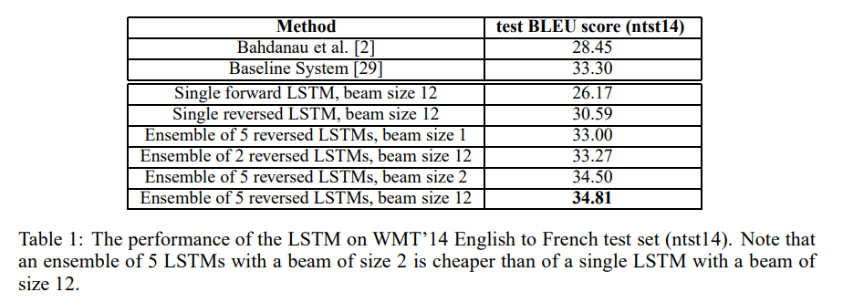
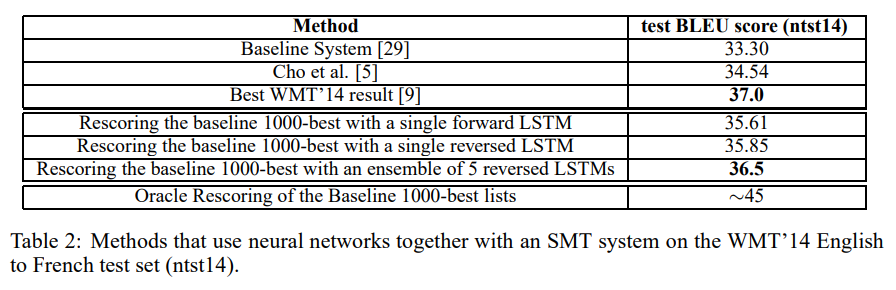
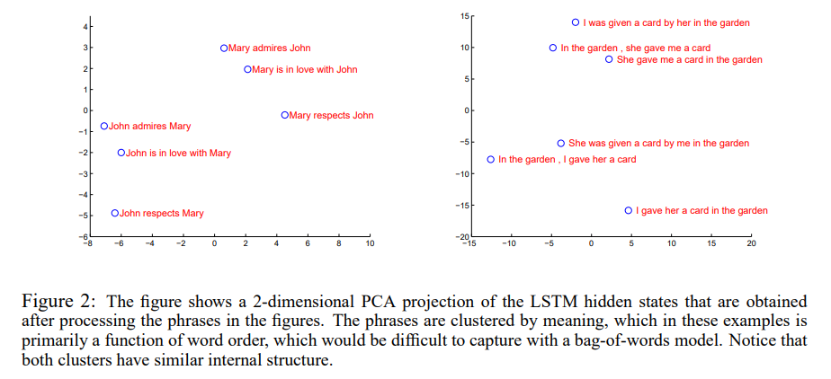
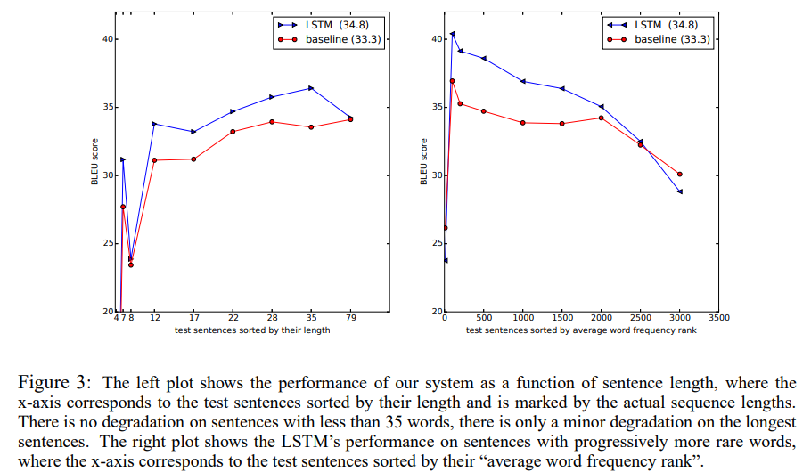

# Sequence to Sequence Learning with Neural Networks

__Ilya Sutskever, Oriol Vinyals, Quoc V.Le__  
*Google*  
*NIPS'14*

## 1. Motivation
### 1.1 Challenge

**Deep Neural Network**  

- Advantages:
    + Can perform arbitrary parallel computation for a modest number of steps.
    + Can be trained with supervised backpropagation whenever the labeled training set has enough information to specify the network's parameters.

- Disadvantages:
    + Cannot be used to map sequences to sequences whose lengths are not known a-priori, because DNNs can only be applied to problems whose inputs and targets can be sensibly encoded with vectors of fixed dimensionality.

### 1.2 Solution
- Use one LSTM to read the input sequence to obtain large fixed-dimensional vector representation, and then use another LSTM to extract the output sequence from the vector.

  

## 2. Model
### 2.1 Function
Estimate the conditional probability p(y_1, ..., y_T'|x_1, ..., x_T) where (x_1, ..., x_T) is an input sequence and (y_1, ..., y_T') is its corresponding output sequence whose length T' may differ from T.

 

Each p(y_t|v, y_1, ..., y_{t-1}) distribution is represented with a softmax over all the words in the vocabulary.

### 2.2 Training
Maximize the log probability of a correct translation T given the source sentence S.

Where |S| is the size of training set.

### 2.3 Decoding
Produce translations by finding the most likely translation according to the LSTM.

Using a simple left-to-right beam search decoder.

## 3. Experiment
### 3.1 Dataset
- WMT'14 English to French MT task
    + On a subset of 12M sentences consisting of 348M French words and 304M English words.
    + Use 160,000 of the most freqeunt words for the source language and 80,000 of the most frequent words for the target language. Every out-of-vocabulary word was replaced with a special "UNK" token.

### 3.2 Two ways
- Directly translate the input sentence without using a reference SMT system.
- Use it to rescore the n-best lists of an SMT baseline.

### 3.3 Trick
> More details can be found in [Paper $3.4](https://arxiv.org/pdf/1409.3215.pdf)

#### 3.3.1 EOS
- Each sentence ends with a special end-of-sentence symbol "<EOS>", which enables the model to define a distribution over sequences of all possible lengths.

#### 3.3.2 LSTMs
- Use two different LSTMs: one for the input sequence and another for the output sequence, because doing so increses the number model parameters at negligible computational cost and makes it natural to train the LSTM on multiple language pairs simultaneously.
- Use deep LSTMs with 4 layers, with 1000 cells at each layer.

#### 3.3.3 Reverse
- Reverse the order of the words of the input sentence.
- Reduce the problem 'minimal time lag', backpropagation has an easier time 'establishing communication' between the source sentence and the target sentence.

### 3.4 Parallelization
- Use an 8-GPU machine.
    + Each layer of the LSTM was executed on a different GPU and communicated its activations to the next GPU.
    + Another 4 GPUs were used to parallelize the softmax.
- Achieve a speed of 6,300 words per second with a minibatch size of 128.
- Training took about a ten days with this implementation.

### 3.5 Results

## 4. Analysis
- The representations are sensitive to the order of words, while being fairly insensitive to the replacement of an active voice with a passive voice.

- The LSTM did well on long sentences.

## 5. Shortages
- The fixed-length vector lost some information during encoding.
- It performs not well when the sentence is too long.

> Solution: Attention.
